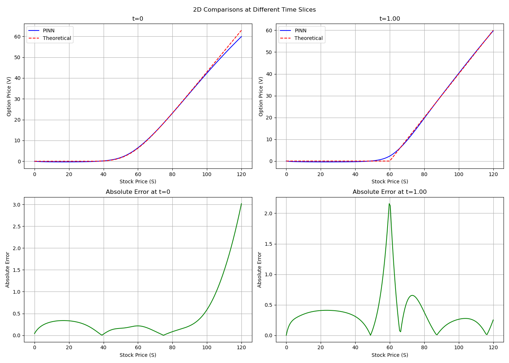
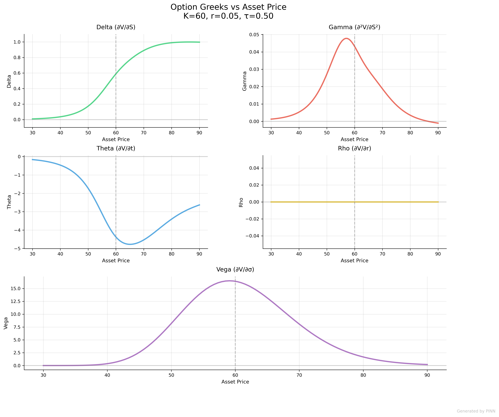

# Physics-Informed Neural Networks for Option Pricing

This repository implements Physics-Informed Neural Networks (PINNs) to solve option pricing partial differential equations (PDEs), specifically the Black-Scholes and Heston models.

## Overview

PINNs combine neural networks with physical laws expressed as PDEs. For option pricing, they learn to satisfy:
- The pricing PDE (Black-Scholes or Heston)
- Initial/boundary conditions for European options
- Market data for calibration

Key features:
- Supports both Black-Scholes and Heston models
- Can train with or without synthetic/market data
- Configurable network architecture and training parameters
- Evaluation against analytical solutions
- Visualization of results
- Greeks calculation
- Implied volatility calculation

## Key Advantages

While PINNs have relatively slow training times compared to traditional methods, their primary strength lies in their ability to incorporate market data into the training process. This makes them valuable for:
1. Calibrating models with real market prices
2. Learning market patterns that might deviate from pure theoretical models
3. Creating hybrid solutions that balance theoretical PDEs with empirical market behavior

Preliminary runnings (Black-Scholes, precision can be improved):

